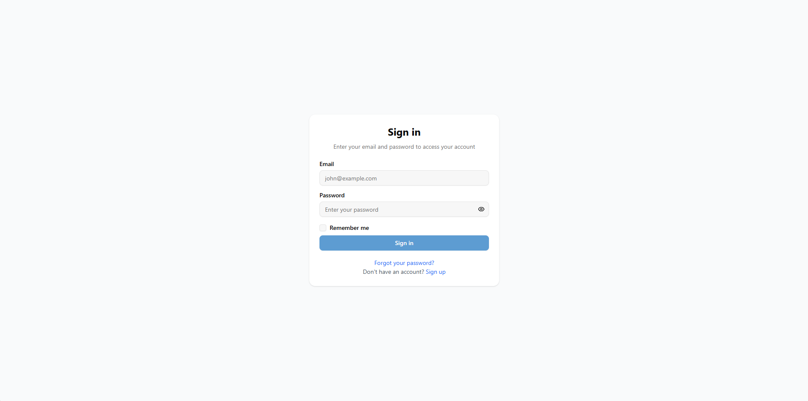
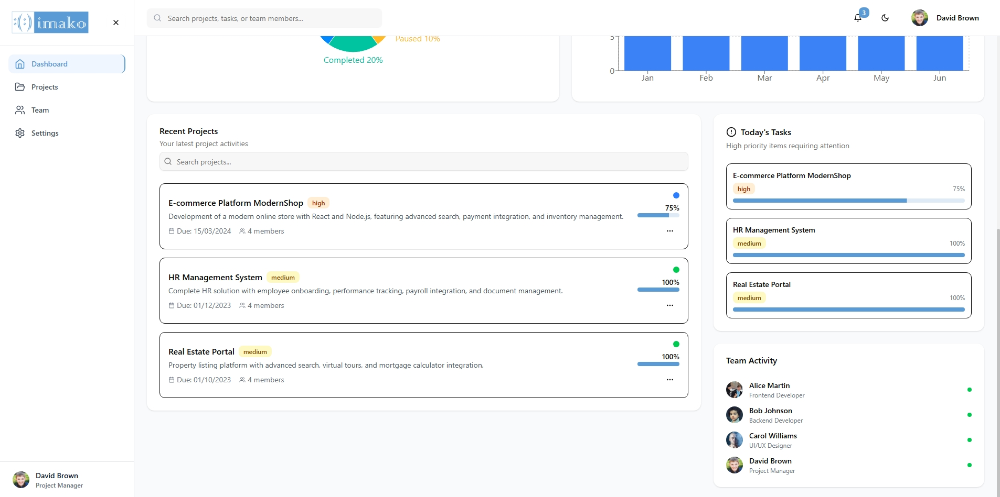
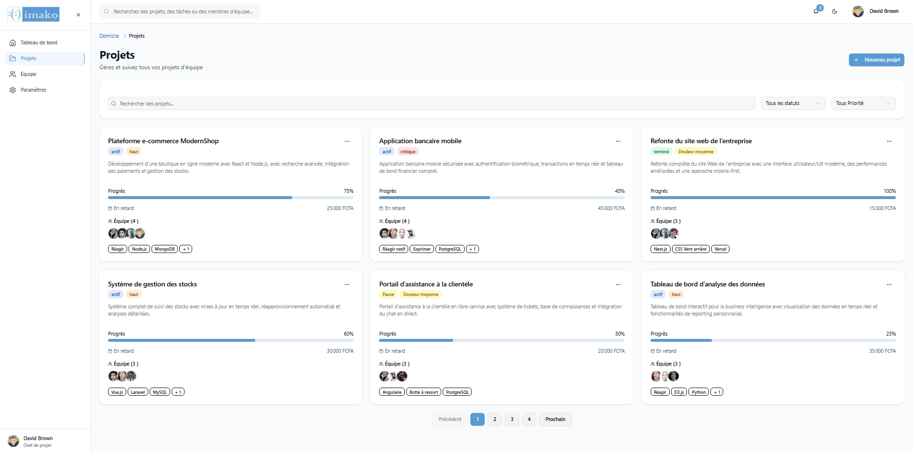
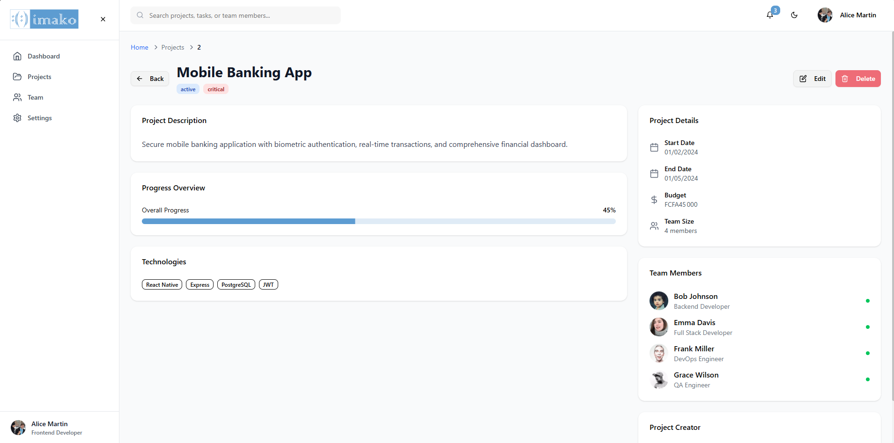
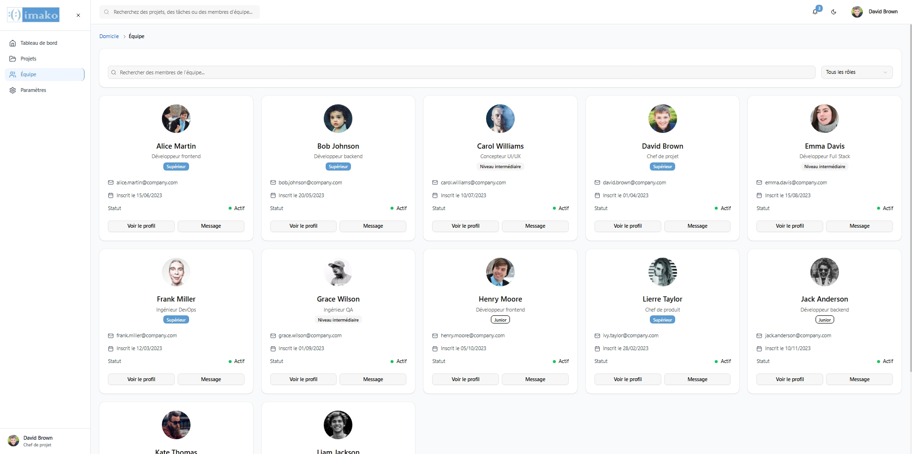
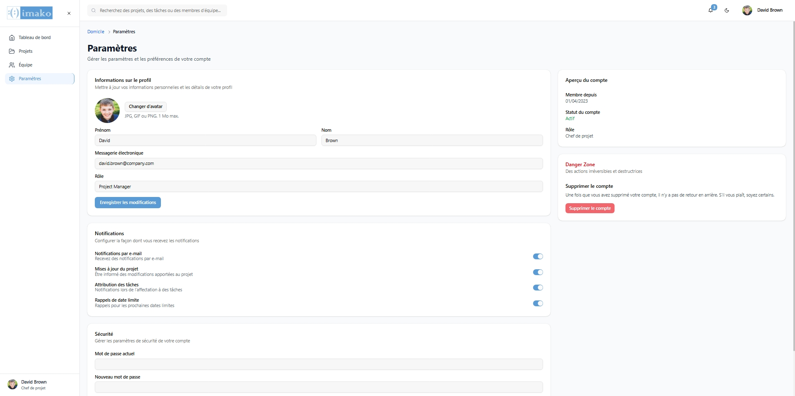

# IMAKO Test

**IMAKO Test** est une application web complète de **gestion de projets d'équipe**, inspirée de Trello/Asana (version simplifiée).  
Elle permet à une équipe de gérer des projets de manière collaborative : inscription, authentification, dashboard personnalisé, création/gestion de projets, assignation de membres, suivi de l’avancement et gestion des priorités.

---

## Fonctionnalités

✅ Inscription et connexion sécurisées  
✅ Tableau de bord personnalisé avec statistiques dynamiques  
✅ Création, modification, suppression de projets (CRUD)  
✅ Assignation de membres d'équipe aux projets  
✅ Suivi de l’avancement et priorités  
✅ Design moderne et responsive (mobile, tablette, desktop)  
✅ Notifications (toasts) et états de chargement  
✅ Mock Data pour simuler API et authentification

---

## Stack Technique

- **Frontend** : React.js + Vite
- **Navigation** : React Router v6 (routes publiques/privées)  
- **UI** : Tailwind CSS + UI Library (Shadcn/ui)  
- **Données** : Mock Data  
- **Graphiques** : CRecharts
- **Gestion d'état** : Context API et local

---

## Prérequis

- Node.js ≥ 18.x
- npm ≥ 8.x
- Git

---

## Installation

```bash
# 1. Cloner le repository
git clone https://github.com/<your-username>/imako-test.git

# 2. Accéder au dossier
cd imako-test

# 3. Installer les dépendances
pnpm install

# 4. Lancer le serveur de développement
pnpm run dev
```

---

## Structure des Mock Data

```javascript
// mockData.js (exemple)

export const projects = [
  {
    id: 1,
    name: "Site e-commerce ModernShop",
    description: "Développement d'une boutique en ligne moderne",
    status: "active",
    priority: "high",
    startDate: "2024-01-15",
    endDate: "2024-03-15",
    assignedUsers: [1, 2],
    progress: 75,
    createdBy: 1,
    technologies: ["React", "Node.js"]
  }
  // ... 19 autres projets
];

export const users = [
  {
    id: 1,
    firstName: "Alice",
    lastName: "Martin",
    email: "alice.martin@company.com",
    password: "password123",
    avatar: "https://i.pravatar.cc/150?img=1",
    role: "Frontend Developer",
    isActive: true
  }
  // ... 11 autres utilisateurs
];
```

- Les opérations CRUD et l’authentification utilisent `useState` ou `useContext`.

---

## Scénarios d'utilisation

- **Inscription** : `/register`  
- **Connexion** : `/login`  
- **Dashboard** : `/dashboard`  
- **CRUD Projet** : création, édition, suppression via formulaires modaux  
- **Assignation Membres** : ajout/retrait d’utilisateurs à un projet  
- **Suivi Statistiques** : graphiques dynamiques sur le dashboard

---

## Captures d’écran

- 
- 
- 
- 
- 
- 
- 
- 

---

## Commandes principales

```bash
# Lancer le projet en dev
pnpm run dev

# Build de production
pnpm run build

# Preview du build
pnpm run preview
```

---

## Contribution

Merci de respecter ces règles pour contribuer :

- **Branches** : `feature/<feature-name>`, `fix/<bug-name>`  
- **Commits** : format conventionnel `type(scope): description`  
- **Pull Requests** : détailler les changements apportés  
- Toujours garder le code commenté, propre et testé

---

## License

Ce projet est sous licence **MIT**.  
Feel free to fork, modify and share!

---

## Déploiement

Le projet peut être déployé sur **Vercel**, **Netlify** ou **GitHub Pages**.

```bash
# Déployer sur Vercel
pnpm dlx vercel deploy
```

---


**Bonne chance et bon code !**
